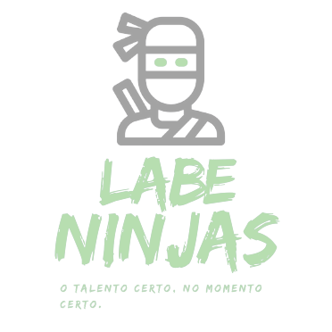

# Projeto Labeninja

### Integrantes do Grupo 9
- João Gabriel Colodetti do Carmo
- Lucas Rafael Martins de Paula
- Bruno Adonai Rodrigues Monteiro
- Guilherme Tocci
- Henrique Dos Santos Rodriguez

### Link para o projeto
http://cloudy-plot.surge.sh

### Sobre
O projeto é uma plataforma para a contratação de serviços de diversas áreas. 
Ele conta com um sistema onde você consegue pesquisar um tipo específico de serviço
e filtrar por valor mínimo e máximo, assim como determinar um prazo para o freelancer
aceitar sua demanda. Foi utilizada uma integração com API que contém as informações de 
cada card de serviços.

### Status do projeto
Concluído

### Imagens 

