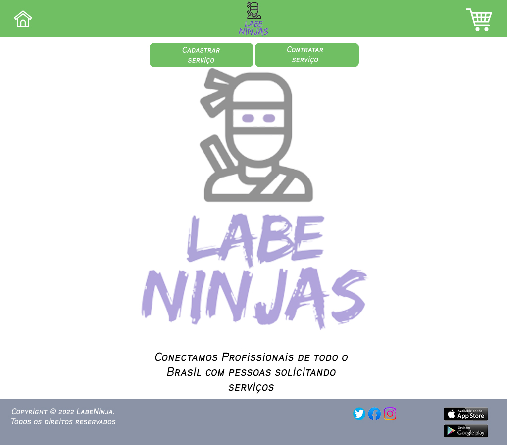
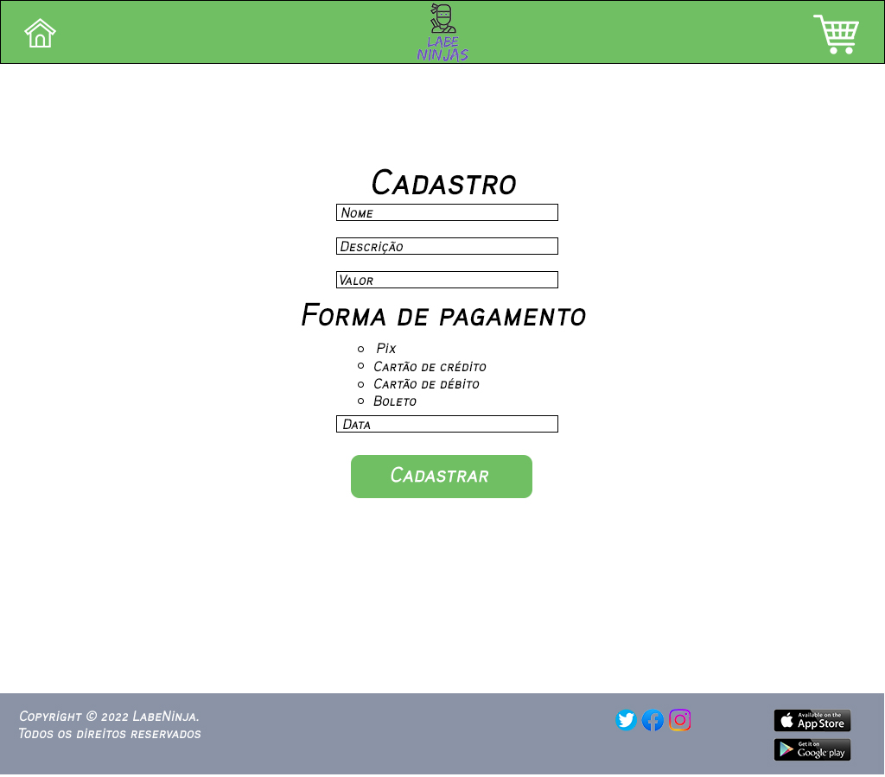
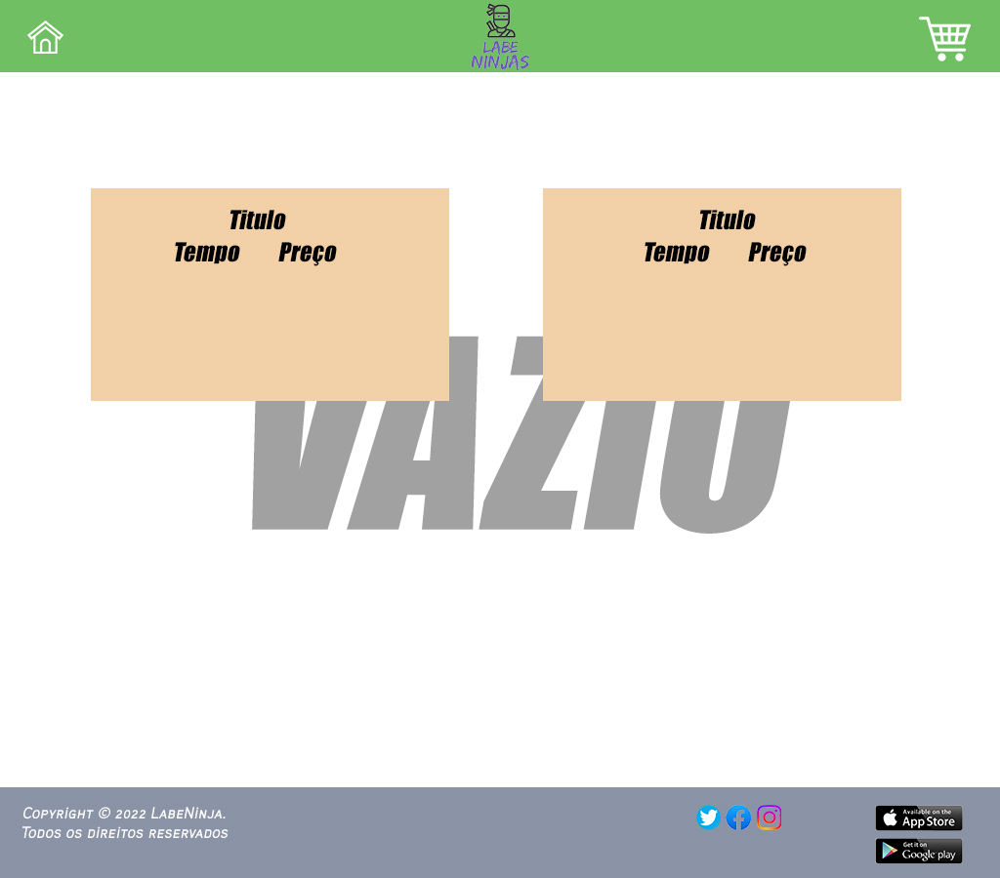
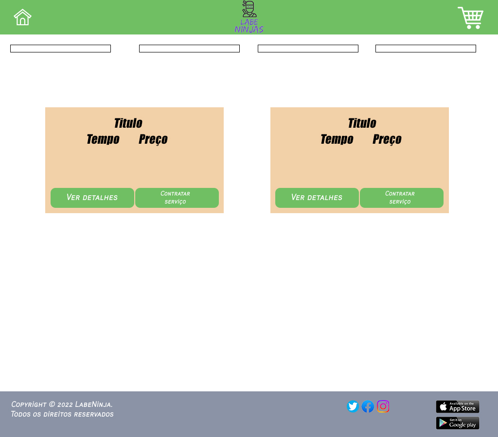

O projeto é uma plataforma para a contratação de serviços de diversas áreas. 
Ele conta com um sistema onde você consegue pesquisar um tipo específico de serviço
e filtrar por valor mínimo e máximo, assim como determinar um prazo para o freelancer
aceitar sua demanda.Será utilizado uma integração com API que contém as informações de 
cada card de serviços.A divisão do trabalho será da seguinte forma :

*Body: Contém informações básicas da tela princípal, cards, tela de compra, adicionar produtos e carrinho.
*Cadastro:Nele deverá ser possivel, adicionar novos serviços com os detalhes e a data de execução.
*Componente Card/Filtro:Ser possível ordenar os cards de acordo com o filtro desejado, criar um botão que 
adicona ao carrinho e também ser possível ao clicar no card mostrar os detalhes de cada produto.
*Componente carrinho:Nele deve ser possível, adicionar e remover itens.
*Troca de telas:Fazer com que as telas sejam alteradas de acordo com navegação.
*Header:Contém o título, com dois botões que direcionam para a Home e para o Carrinho.
*Footer:Contém informações de contato e redes sociais, além da sugestão de baixar o app pela Playstore ou
Appstore

Membros responsáveis do projeto:

*Cadastro: Bruno e Henrique.

*Componente Card/Filtro: Lucas.

*Carrinho: João e Guilherme.

*Troca de telas: Henrique, Guilherme e João.

*Header e Footer: Lucas.

